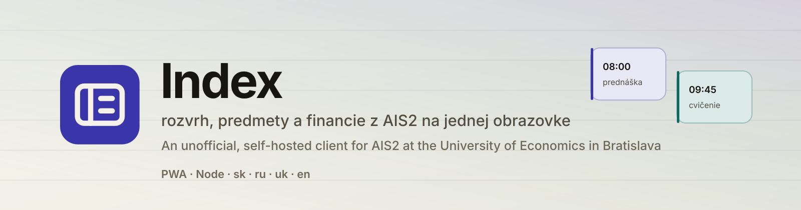
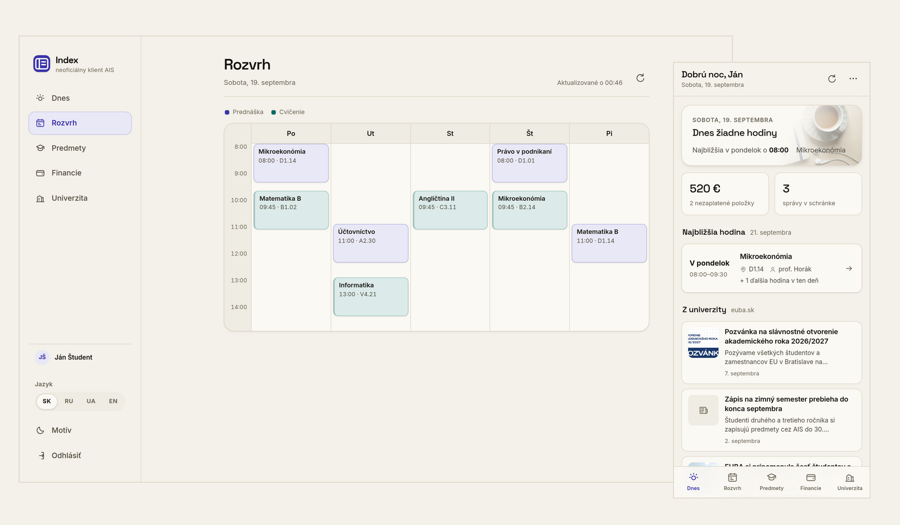
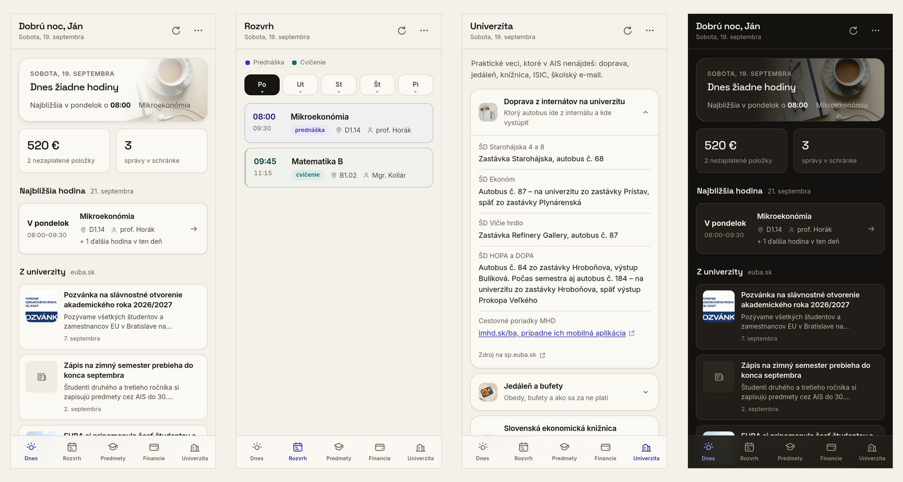
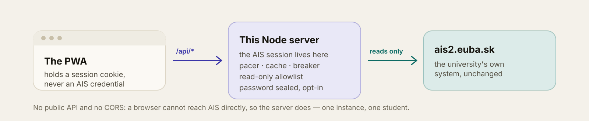

<p align="center">
  
</p>

<p align="center">
  
  
  
  
  
  
  
</p>

<p align="center">
  <b>English</b> ·
  <a href="README.sk.md">Slovenčina</a> ·
  <a href="README.ru.md">Русский</a> ·
  <a href="README.uk.md">Українська</a> ·
  <a href="SECURITY.md">Security</a> ·
  <a href="deploy/">Deploy</a>
</p>

# Index

An unofficial client for **AIS2 at the University of Economics in Bratislava** (`ais2.euba.sk`):
your timetable, subjects and grades, fees and messages on one screen that opens in under a second on
a phone. A PWA with a small Node proxy behind it, meant to be self-hosted — one instance per person,
or per group of people who trust each other.

<p align="center">
  
</p>

## What it does

- **Today** — the lesson happening now or the next one, what you owe, what is in your inbox. Before
  the semester starts it says when it starts, rather than showing an empty screen.
- **Timetable** — the week as a grid on a desktop, a day at a time on a phone. Lectures and seminars
  carry different colours; a free day shows the nearest day that is not.
- **Subjects** — enrolled subjects, credits, grades and the weighted average, plus the study plan.
- **Finances and messages** — fees with their variable symbols, and the AIS message feed beside them,
  because most of those messages are about payments anyway.
- **University** — the practical things AIS never tells you: transport from the dorms, the canteens,
  the library, ISIC prolongation, university e-mail.
- **Four languages** — Slovak, Russian, Ukrainian and English, each with its own plural rules and
  date forms. What AIS itself sends (subject names, message categories) stays in Slovak, and the app
  says so out loud.
- **Installable** — a real PWA: it offers to install itself, the shell works offline, and the data
  never does, because a cached grade is a wrong grade.

<p align="center">
  
</p>

## How it works

AIS has no public API, and its CORS policy rules out talking to it from a browser. So this is a
**server-side proxy** — not a browser extension, and not a "paste your cookie here" tool:

<p align="center">
  
</p>

The auth chain is the one the official Angular SPA uses: a form post to `/ais/login.do` for a
`JSESSIONID`, a token minted at `/ais/rest/apps/get-access-token`, then every REST call carrying
both. The server re-mints the token when it goes stale and re-logs in at most once a minute.

Your AIS password is used to sign in and is then held **in the server's memory**. If you tick "stay
signed in", it is additionally stored sealed with AES-256-GCM in the state directory, with the key in
a `0600` file beside it. That defends a stolen backup, not someone who already has the machine — and
the sign-in screen says exactly that, in those words, before you type anything.

### Being a polite client

Everything upstream goes through one pacer: a minimum gap between calls, a per-minute ceiling,
jitter, single-flight deduplication of identical concurrent reads, and a TTL cache per endpoint (a
timetable is good for fifteen minutes). Repeated failed sign-ins trip a circuit breaker keyed per
account, because hammering a wrong password is what actually gets an AIS account locked.

## Running it

```bash
npm install
AIS_MOCK=1 npm start     # demo data, no AIS account needed — http://localhost:4173
npm start                # the real thing; sign in with your AIS2 credentials
```

On a server, `deploy/deploy.sh` does the whole thing — systemd unit, nginx vhost, Let's Encrypt:

```bash
DOMAIN=ais.example.com LE_EMAIL=you@example.com deploy/deploy.sh
```

The app binds to localhost only; terminate TLS in front of it.

| Variable | Default | What it is |
| --- | --- | --- |
| `PORT` | `4173` | port to listen on |
| `AIS_BASE` | `https://ais2.euba.sk` | upstream AIS |
| `AIS_LNG` | `SK` | the language AIS answers in |
| `AIS_SECRET` | — | key for sealing remembered passwords (64 hex characters or a passphrase); otherwise a key file is generated |
| `AIS_STATE_DIR` | `/var/lib/ais-pwa` | where sessions and that key live |
| `AIS_SESSION_DAYS` | `30` | how long a remembered session lasts |
| `AIS_GA_ID` | — | analytics id for this instance, if you want analytics at all |
| `AIS_MOCK` | — | `1` serves demo data and never touches AIS |
| `AIS_RAW` | — | `1` enables the read-only passthrough used when calibrating adapters; leave it off |

## Layout

```
server/aisClient.js     the AIS auth chain, REST access and the response normalisers
server/security.js      headers, rate limits, same-origin checks, path safety
server/guard.js         pacer, single-flight, TTL cache, per-account login breaker
server/sessionStore.js  sessions on disk, and the sealed password behind "stay signed in"
server/index.js         express: sessions, a clean /api/*, static files
public/                 the PWA — no build step, no framework, no bundler
public/i18n.js          every sentence in four languages, with per-language plural rules
scripts/handbook/       sources for the University screen; public/handbook.js is generated
```

## Security

- session cookie is `HttpOnly`, `SameSite=Lax`, `Secure`, 192 bits of entropy, sliding expiry;
  state-changing requests from another origin are refused outright;
- a strict Content-Security-Policy with `frame-ancestors 'none'` and no inline scripts anywhere;
- `Cache-Control: no-store` on every API response;
- per-IP rate limits in front of the API, and a tighter one in front of the sign-in form;
- the passthrough allows AIS paths **explicitly** and rejects anything containing `..` — AIS exposes
  destructive operations over plain `GET`, so refusing by HTTP verb would not be enough;
- captured real AIS responses (used for offline QA) are git-ignored and have never been committed.

Found something? See [SECURITY.md](SECURITY.md).

## What this is not

It is **not affiliated with, endorsed by, or connected to the University of Economics in Bratislava**.
It reads the same data the official AIS2 client reads, with your own credentials, on a server you
control, and it never writes anything back: every AIS call it makes is a read.

The University screen is a snapshot of public pages from the Student Parliament, rewritten in our own
words, with a source link and a "last checked" date on every card. It is not a mirror of the
university's text, and the university's own pages are what counts if the two disagree.

If you do not run the server yourself, you are trusting whoever does with your university password.
That is a real cost, and the honest advice is to self-host.

## Licence

MIT — see [LICENSE](LICENSE). The screenshots and the images under `public/photos/` were made for
this project and are covered by the same licence.
